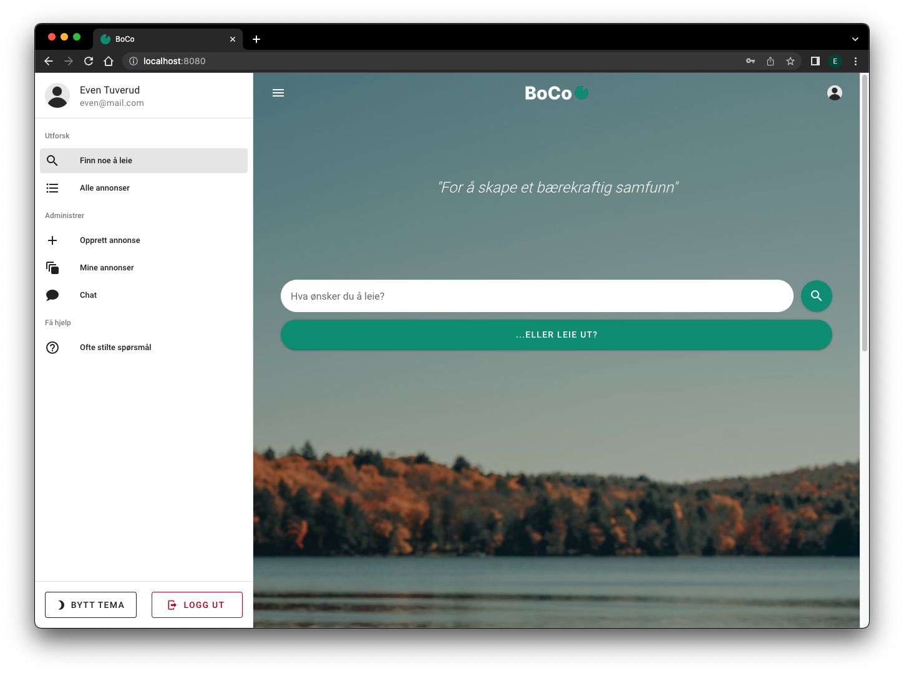
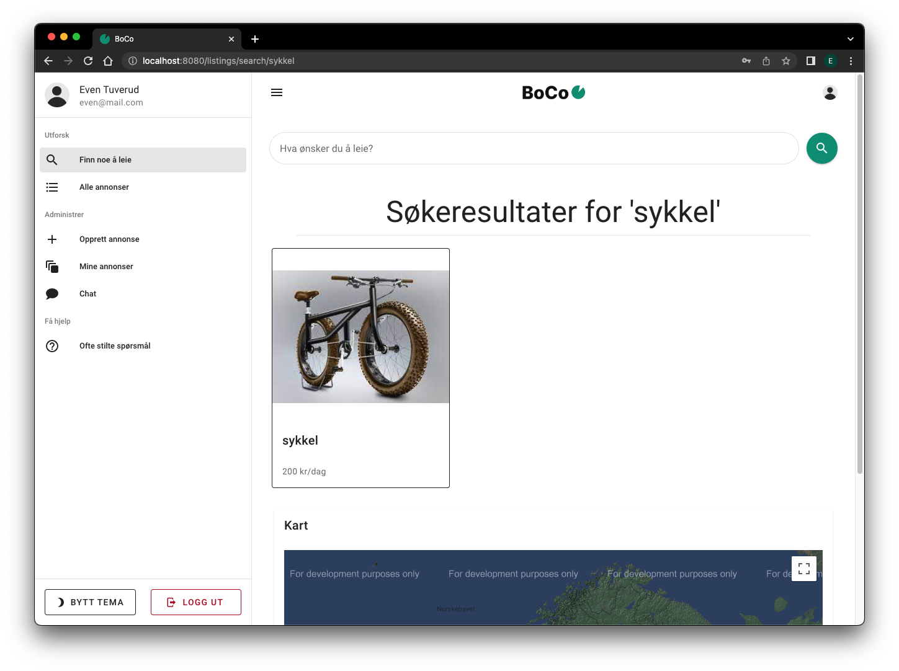

# BoCo - Borrowing Company

This web application is the result of a group project in the course IDATT2106 Systemutvikling 2 (SCRUM- project)

The team consisted of nine members working full time with this projected over three weeks

The team was following the SCRUM methodology with daily standups, burndown charts, sprint reviews etc.

The application is a fully functional web application where users can list and borrow items from other users, chat with other users and see available items on a map.

The application is made with Vue.js fronent and Java Spring Boot backend, and H2 database for storage. 

Features:
- Register and log in
- List an item with adress, price, images and description
- Show available items on a map 
- Search for items with keywords
- Chat with other users 
- Notifications on requests and chat messages
- Websockets for instant chat and notifications
- Give rating to users you interact with

